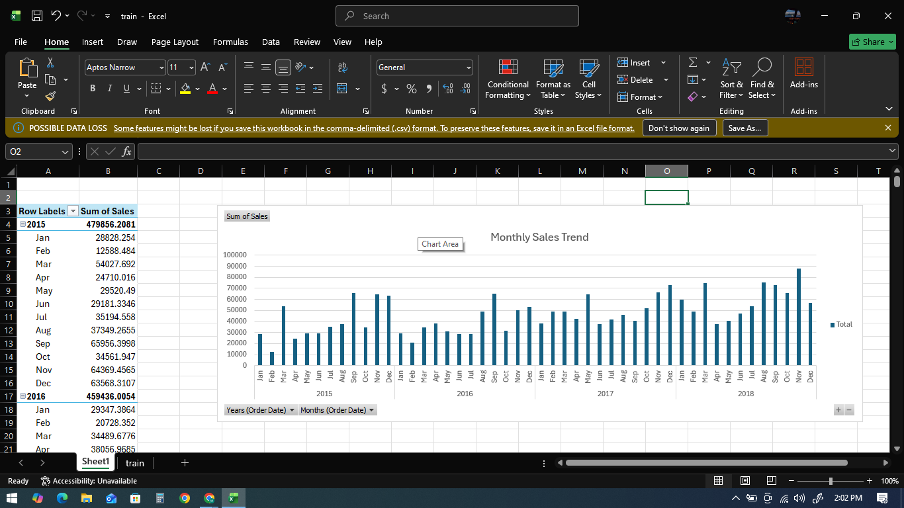

# 📊 Sales Analysis Project

## 🔹 Objective
Analyze sales data to identify trends, top-performing products, and revenue insights.

## 🔹 Tools Used
- Excel
- SQL (optional if used)
- Power BI

## 🔹 Dataset
- File: train.xlsx
- Contains sales transactions including product, region, revenue, etc.

## 🔹 Key Insights
- Top-selling products
- Monthly sales trends
- Regional performance
- Profit analysis

## 🔹 Dashboard

## 🔹 Project Files
- train.xlsx → Raw dataset
- dashboard.png → Visualization output

## 🔹 Conclusion
This project helps businesses understand sales patterns and improve decision-making.

## 🔹 Author
Aravind
